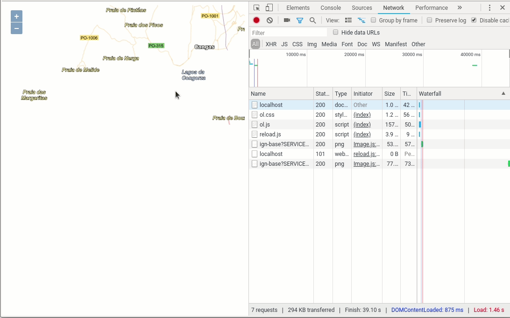
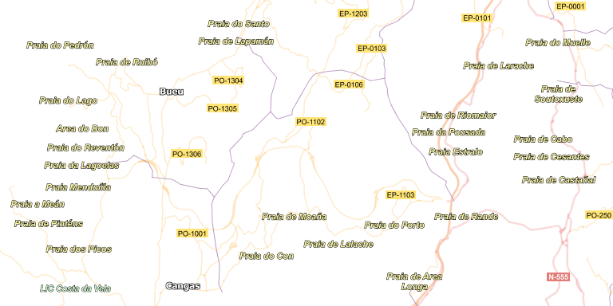
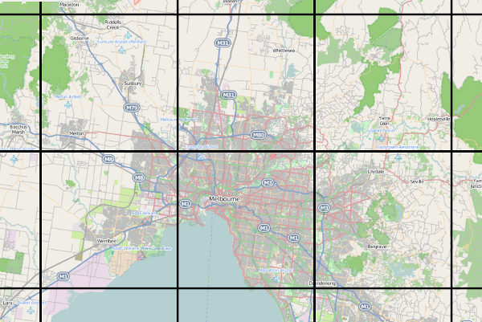
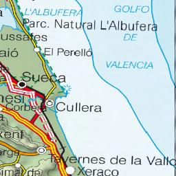
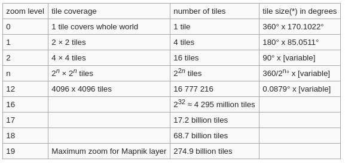

# Y si los datos son enormes

!!! note "Autores"
    * Micho García · [@michogar](https://twitter.com/michogar) · [micho.garcia@geomati.co](micho.garcia@geomati.co)
!!! note "Licencia"
    <a rel="license" href="http://creativecommons.org/licenses/by-sa/4.0/"></a><br />Esta obra está bajo una <a rel="license" href="http://creativecommons.org/licenses/by-sa/4.0/">Licencia Creative Commons Atribución-CompartirIgual 4.0 Internacional</a>.

En el apartado anterior hemos utilizado el servicio WFS para la descarga de datos. Lo que conseguíamos era descargar archivos en formato GeoJSON con las geometrías y las representábamos en nuestro visor. ¿Qué pasaría si quisiéramos descargar todas las carreteras de la Península en ese formato?, el tamaño del archivo sería muy grande y tardaríamos una eternidad en descargarlo. 

Habitualmente los servicios WFS están limitados para realizar grandes descargas ya que son peticiones que podrían tirar un servidor. Y en el caso de que se permita la descarga de grandes datos, es conveniente utilizar filtros o limitantes del número de elementos a descargar.

Siguiendo con el ejemplo que anterior, el de las carreteras de la Península, ¿cómo haríamos para descargar la Red de Carreteras de España?. Para esto podríamos utilizar un servicio que ya conocemos, el WMS. 

La Red de Carreteras está proporcionado por el [IGN](http://www.ign.es/web/ign/portal) y se pueden ver las capacidades del servicio [aquí](http://www.ign.es/wms-inspire/ign-base?request=GetCapabilities&service=WMS).

Crearemos una carpeta `ol-wms` con un archivo `index.html` de la siguiente manera

```html
<!DOCTYPE html>
<html>
  <head>
    <title>WMS y OpenLayers</title>
    <link rel="stylesheet" href="https://openlayers.org/en/v5.2.0/css/ol.css" type="text/css">
  </head>
  <body>
     <div id="map" class="map"></div>
    <script src="https://cdn.rawgit.com/openlayers/openlayers.github.io/master/en/v5.2.0/build/ol.js"></script>
    <script>
      let map = new ol.Map({
        target: 'map',
        view: new ol.View({
          center: ol.proj.fromLonLat([-8.8120584, 42.2154941]),
          zoom: 12
        })
      });
    </script>
  </body>
</html>
```

en este caso la capa WMS que añadiremos será la correspondiente a las carreteras. Si inspeccionamos el servicio, encontraremos lo que necesitamos

```XML hl_lines="2"
<Layer queryable="1">
<Name>IGNBaseOrto</Name>
<Title>Callejero para imagen</Title>
<Abstract>
Representación cartográfica preparada para superponer la información geográfica sobre otros fondos como las ortoimágenes.
</Abstract>
<KeywordList>
<Keyword>Hidrografía</Keyword>
<Keyword>Transporte</Keyword>
<Keyword>Catastro</Keyword>
<Keyword>BTN</Keyword>
<Keyword>Cartociudad</Keyword>
</KeywordList>
<CRS>EPSG:4258</CRS>
<EX_GeographicBoundingBox>
<westBoundLongitude>-19.0</westBoundLongitude>
<eastBoundLongitude>5.0</eastBoundLongitude>
<southBoundLatitude>27.0</southBoundLatitude>
<northBoundLatitude>44.0</northBoundLatitude>
</EX_GeographicBoundingBox>
<BoundingBox CRS="CRS:84" minx="-19.0" miny="27.0" maxx="5.0" maxy="44.0"/>
<BoundingBox CRS="EPSG:4258" minx="27.0" miny="-19.0" maxx="44.0" maxy="5.0"/>
<BoundingBox CRS="EPSG:4326" minx="27.000000021351063" miny="-19.000000000000007" maxx="44.000000040852704" maxy="5.0"/>
<BoundingBox CRS="EPSG:3857" minx="-2115070.3250721986" miny="3123471.7517721104" maxx="556597.4539663679" maxy="5465442.189644802"/>
<BoundingBox CRS="EPSG:3035" minx="471468.5017937361" miny="1445891.6963879904" maxx="2768821.4534321986" maxy="3919390.1873301356"/>
<BoundingBox CRS="EPSG:25828" minx="102948.3712066114" miny="2986435.2424698113" maxx="2508202.7078731647" maxy="5070480.910834041"/>
<BoundingBox CRS="EPSG:25829" minx="-495135.75545797264" miny="2988008.1382796224" maxx="1897204.2192799984" maxy="4968139.496861154"/>
<BoundingBox CRS="EPSG:25830" minx="-1099673.713805158" miny="2986435.2424698113" maxx="1295248.9457888722" maxy="4998012.35979611"/>
<BoundingBox CRS="EPSG:25831" minx="-1714549.1480732663" miny="2988008.1382796224" maxx="698454.2342175536" maxy="5113259.329733409"/>
<BoundingBox CRS="EPSG:32628" minx="102948.37128314428" miny="2986435.244922726" maxx="2508202.7074604286" maxy="5070480.915489917"/>
<BoundingBox CRS="EPSG:32629" minx="-495135.75526346336" miny="2988008.140733385" maxx="1897204.2190024962" maxy="4968139.50151943"/>
<BoundingBox CRS="EPSG:32630" minx="-1099673.713484239" miny="2986435.244922726" maxx="1295248.94563436" maxy="4998012.364454182"/>
<BoundingBox CRS="EPSG:32631" minx="-1714549.1476116255" miny="2988008.140733385" maxx="698454.2341793771" maxy="5113259.334386855"/>
<Attribution>
<Title>Sistema Cartográfico Nacional</Title>
<OnlineResource xmlns:xlink="http://www.w3.org/1999/xlink" xlink:type="simple" xlink:href="http://www.scne.es"/>
</Attribution>
<AuthorityURL name="IGN">
<OnlineResource xlink:type="simple" xlink:href="http://www.ign.es"/>
</AuthorityURL>
<Identifier authority="IGN">ignbase_orto</Identifier>
<MetadataURL type="ISO19115:2003">
<Format>text/plain</Format>
<OnlineResource xlink:type="simple" xlink:href="http://www.ign.es/csw-inspire/srv/spa/csw?SERVICE=CSW&VERSION=2.0.2&REQUEST=GetRecordById&outputSchema=http://www.isotc211.org/2005/gmd&ElementSetName=full&ID=spaigncapawmswmtswmscignbaseorto20140301"/>
</MetadataURL>
<Style>
<Name>default</Name>
<Title>IGN- Base: Estilo para imagen</Title>
<Abstract>
Representación de objetos geográficos conforme al estilo definido para ellos en función de su tipología y con el fin de ser utilizados con cartografía de fondo, especiamente ortofotografía.
</Abstract>
<LegendURL width="202" height="117">
<Format>image/png</Format>
<OnlineResource xmlns:xlink="http://www.w3.org/1999/xlink" xlink:type="simple" xlink:href="http://www.ign.es/wms-inspire/ign-base/leyendas/ignbase_orto.png"/>
</LegendURL>
</Style>
</Layer>
```

y configuraremos la capa en nuestro visor de la siguiente manera.

```html
<!DOCTYPE html>
<html>
  <head>
    <title>WMS y OpenLayers</title>
    <link rel="stylesheet" href="https://openlayers.org/en/v5.2.0/css/ol.css" type="text/css">
  </head>
  <body>
     <div id="map" class="map"></div>
    <script src="https://cdn.rawgit.com/openlayers/openlayers.github.io/master/en/v5.2.0/build/ol.js"></script>
    <script>
      const carreteras = new ol.layer.Image({
        source: new ol.source.ImageWMS({
          url: 'http://www.ign.es/wms-inspire/ign-base?',
          params: {'LAYERS': 'IGNBaseOrto'},
        })
      })
      let map = new ol.Map({
        target: 'map',
        view: new ol.View({
          center: ol.proj.fromLonLat([-8.8120584, 42.2154941]),
          zoom: 12
        }),
      layers: [
        carreteras
      ]
      });
    </script>
  </body>
</html>
```

Ya podemos ver la Red de Carreteras en nuestro visor. Si inspeccionásemos la pestaña *Network* de la consola de desarrolladores de nuestro navegador, podríamos ver que cada vex que movemos el mapa se realiza una petición al servicio 



Si abrimos alguna de estas peticiones comprobaremos que lo que nos está devolviendo es una imagen

[http://www.ign.es/wms-inspire/ign-base?SERVICE=WMS&VERSION=1.3.0&REQUEST=GetMap&FORMAT=image%2Fpng&TRANSPARENT=true&LAYERS=IGNBaseOrto&CRS=EPSG%3A3857&STYLES=&WIDTH=768&HEIGHT=384&BBOX=-985655.4797373477%2C5199705.2861274%2C-956303.6608758401%2C5214381.195558153](http://www.ign.es/wms-inspire/ign-base?SERVICE=WMS&VERSION=1.3.0&REQUEST=GetMap&FORMAT=image%2Fpng&TRANSPARENT=true&LAYERS=IGNBaseOrto&CRS=EPSG%3A3857&STYLES=&WIDTH=768&HEIGHT=384&BBOX=-985655.4797373477%2C5199705.2861274%2C-956303.6608758401%2C5214381.195558153)



Lo que estamos haciendo es pedir imágenes cada vez que movemos el mapa. Y aunque el movimiento sea mínimo, y la mayor parte del mapa no la vayamos a refrescar, el servicio hace una peticion de todo el mapa, algo que no es nada óptimo.

Para resolver este tema se creó el concepto de `Tile` o `Tesela` en castellano, que se trataba de cortar la imagen en cuadrados de un tamaño dado como si se tratase de azulejos (de hay el nombre de [`Tile`](https://translate.google.com/#en/es/tile))


*By Stevage - Own work, CC BY-SA 4.0, https://commons.wikimedia.org/w/index.php?curid=34728162*

Hay varios estándares que trabajan de esta manera, TMS, WMS-T o el estandar de facto XYZ. A continuación veremos algunos de ellos.

## WMTS
Tal vez los conceptos del WMTS sean complejos y se escapan al objetivo de este curso, así que simplemente daremos unas recetas de como implementar estos servicios. 

Lo primero crear una carpeta `ol-wmts` con un archivo `index.html`

```html
<!DOCTYPE html>
<html>
  <head>
    <title>WMTS y OpenLayers</title>
    <link rel="stylesheet" href="https://openlayers.org/en/v5.2.0/css/ol.css" type="text/css">
  </head>
  <body>
     <div id="map" class="map"></div>
    <script src="https://cdn.rawgit.com/openlayers/openlayers.github.io/master/en/v5.2.0/build/ol.js"></script>
    <script>
      let map = new ol.Map({
        target: 'map',
        view: new ol.View({
          center: ol.proj.fromLonLat([-8.8120584, 42.2154941]),
          zoom: 12
        })
      });
    </script>
  </body>
</html>
```
Las capas teseladas se implementan en OpenLayers mediante el objeto `ol.layer.Tile`. Este objeto tiene varias fuentes posibles para servidores WMS: `ol.source.TileWMS` y `ol.source.ImageWMS`

OpenLayers también nos proporciona el objeto `ol.source.WMTS`, que nos permite realizar peticiones de teselas de un servidor WMTS.

La clase `ol.source.WMTS`  acepta una serie de propiedades para controlar los parámetros del WMTS que sacaremos como siempre de las capacidades del servicio

* url: La url del servidor. En nuestro caso: `http://www.ign.es/wmts/mapa-raster`.
* layer: el nombre de la capa. `MTN`.
* style: el estilo que se usará (debe estar en el servidor).
* matrixSet: el nombre de la matriz que usaremos. En nuestro caso `EPSG:4326`.
* tileGrid: especifica la malla de teselas que se utilizará. Debe ser una instancia de `ol.tilegrid.WMTS`. En el que se indicará la proyección, resolución y matriz.

Estos datos, como hemos hecho hasta ahora, los obtendremos de las capacidades del servicio que podemos ver en [http://www.ign.es/wmts/mapa-raster?request=GetCapabilities&service=WMTS](http://www.ign.es/wmts/mapa-raster?request=GetCapabilities&service=WMTS)

```XML hl_lines="10 22"
<Layer>
<ows:Title>Cartografía del IGN</ows:Title>
<ows:Abstract>
Capa de cartografía raster del IGN. Datos mostrados en función de la escala de visualización: - Mapa 2M: hasta 305m/px. - Mapa 1M: hasta 152 m/px. - Mapa 500: hasta 50 m/px. - Mapa 200: hasta 20 m/px. - MTN50: hasta 5 m/px. - MTN25: desde 5 m/px
</ows:Abstract>
<ows:WGS84BoundingBox>
<ows:LowerCorner>-18.162 21.899</ows:LowerCorner>
<ows:UpperCorner>6.289 45.286</ows:UpperCorner>
</ows:WGS84BoundingBox>
<ows:Identifier>MTN</ows:Identifier>
<ows:Metadata xlink:href="http://www.ign.es/csw-inspire/srv/spa/csw?SERVICE=CSW&VERSION=2.0.2&REQUEST=GetRecordById&outputSchema=http://www.isotc211.org/2005/gmd&ElementSetName=full&ID=spaigncapawmtswmscmaparaster20130531"/>
<Style isDefault="true">
<ows:Identifier>default</ows:Identifier>
<ows:LegendURL width="1295" height="346" format="image/png" xlink:href="http://www.ign.es/wms-inspire/mapa-raster/leyendas/mtn25.png"/>
</Style>
<Format>image/jpeg</Format>
<Format>image/png</Format>
<TileMatrixSetLink>
<TileMatrixSet>InspireCRS84Quad</TileMatrixSet>
</TileMatrixSetLink>
<TileMatrixSetLink>
<TileMatrixSet>EPSG:4326</TileMatrixSet>
</TileMatrixSetLink>
<TileMatrixSetLink>
<TileMatrixSet>EPSG:4258</TileMatrixSet>
</TileMatrixSetLink>
<TileMatrixSetLink>
<TileMatrixSet>EPSG:32630</TileMatrixSet>
</TileMatrixSetLink>
<TileMatrixSetLink>
<TileMatrixSet>EPSG:25830</TileMatrixSet>
</TileMatrixSetLink>
<TileMatrixSetLink>
<TileMatrixSet>EPSG:32628</TileMatrixSet>
</TileMatrixSetLink>
<TileMatrixSetLink>
<TileMatrixSet>EPSG:25828</TileMatrixSet>
</TileMatrixSetLink>
<TileMatrixSetLink>
<TileMatrixSet>GoogleMapsCompatible</TileMatrixSet>
</TileMatrixSetLink>
</Layer>
```

Aquí vemos el código necesario para mostrar una capa teselada del IGN en WGS84 utilizando una fuente WMTS:

```html
<!DOCTYPE html>
<html>
  <head>
    <title>WMTS y OpenLayers</title>
    <link rel="stylesheet" href="https://openlayers.org/en/v5.2.0/css/ol.css" type="text/css">
  </head>
  <body>
     <div id="map" class="map"></div>
    <script src="https://cdn.rawgit.com/openlayers/openlayers.github.io/master/en/v5.2.0/build/ol.js"></script>
    <script>
      let map = new ol.Map({
        target: 'map',
        view: new ol.View({
          center: ol.proj.fromLonLat([-8.8120584, 42.2154941]),
          zoom: 8
        })
      });

	const projection = ol.proj.get('EPSG:4326');
	const projectionExtent = projection.getExtent();
    const size = ol.extent.getWidth(projectionExtent) / 512;
	const resolutions = new Array(18);
	const matrixIds = new Array(18);
	for (let z = 0; z < 18; ++z) {
		 resolutions[z] = size / Math.pow(2, z);
		 matrixIds[z] = "EPSG:4326:" + z;
	}

    const tileGrid = new ol.tilegrid.WMTS({
	  origin: ol.extent.getTopLeft(projectionExtent),
      resolutions: resolutions,
      matrixIds: matrixIds
    });

    const ign_source = new ol.source.WMTS({
        url: 'http://www.ign.es/wmts/mapa-raster',
        layer: 'MTN',
        matrixSet: 'EPSG:4326',
        format: 'image/jpeg',
        projection: 'EPSG:4326',
        tileGrid: tileGrid,
        style: 'normal',
        attributions: '<a href="http://www.ign.es" target="_blank">IGN.es</a>'
    });

    const ign = new ol.layer.Tile({
       source: ign_source
    });

    map.addLayer(ign);
    </script>
  </body>
</html>
```

Si ahora revisamos la pestaña *Network* del navegador, comprobaremos que la carga de la imagen se realiza en porciones, `teselas` de manera más fluida. Si inspeccionamos una de estas peticiones podremos comprobar en efecto como cada una de ellas corresponde a una de estas teselas.


[http://www.ign.es/wmts/mapa-raster?layer=MTN&style=normal&tilematrixset=EPSG%3A4326&Service=WMTS&Request=GetTile&Version=1.0.0&Format=image%2Fjpeg&TileMatrix=EPSG%3A4326%3A9&TileCol=511&TileRow=144](http://www.ign.es/wmts/mapa-raster?layer=MTN&style=normal&tilematrixset=EPSG%3A4326&Service=WMTS&Request=GetTile&Version=1.0.0&Format=image%2Fjpeg&TileMatrix=EPSG%3A4326%3A9&TileCol=511&TileRow=144)



## XYZ
El estandar de facto [XYZ](https://wiki.openstreetmap.org/wiki/Slippy_map_tilenames) se trata de una convención que "naming" para la publicación de información geográfica desde una estructura de directorios. 

Así, se deberá cumplir las siguientes especificaciones para que se trate de este tipo de servicio

* Las `teselas` que se sirvan deberán tener un tamaño de 256 x 256 pixels y en formato PNG
* Cada nivel de zoom será un directorio, cada columna es un subdirectorio y cada tesela es un archivo dentro de ese directorio.
* La URL a cada archivo será de la forma `zoom/x/y.png`

Lo que se define es como tiene que ser la estructura de las carpetas que podremos servir directamente desde un servidor HTTP común. El inconveniente de este tipo de servicios es que necesitan de una gran capacidad de almacenamiento. Como podemos ver en la imagen a continuación, el número de archivos va creciendo según aumentamos el nivel de zoom.


Relación entre el número de archivos por nivel de zoom. Fuente: [Zoom Levels. Wiki OpenStreetMap](https://wiki.openstreetmap.org/wiki/Slippy_map_tilenames#Zoom_levels)

Este tipo de servicios son utilizados de manera intensiva por la Comunidad de OpenStreetMap, y en su [Wiki](https://wiki.openstreetmap.org/wiki/Tile_servers) podremos encontrar varios de estos servicios que están a nuestra disposición.

Para configurar un servicio XYZ con OpenLayers, lo primero será crear la carpeta `ol-xyz` y añadiremos nuestra plantilla `index.html`

```html
<!DOCTYPE html>
<html>
  <head>
    <title>XYZ y OpenLayers</title>
    <link rel="stylesheet" href="https://openlayers.org/en/v5.2.0/css/ol.css" type="text/css">
  </head>
  <body>
     <div id="map" class="map"></div>
    <script src="https://cdn.rawgit.com/openlayers/openlayers.github.io/master/en/v5.2.0/build/ol.js"></script>
    <script>
      const PNOA = new ol.layer.Image({
        source: new ol.source.ImageWMS({
          url: 'http://www.ign.es/wms-inspire/pnoa-ma?',
          params: {'LAYERS': 'OI.OrthoimageCoverage'},
        })
      })
      let map = new ol.Map({
        target: 'map',
        view: new ol.View({
          center: ol.proj.fromLonLat([-8.8120584, 42.2154941]),
          zoom: 11
        }),
      layers: [
        PNOA
      ]
      });
    </script>
  </body>
</html>
```

El objeto que nuevo utilizaremos para configurar este tipo de servicios será la fuente `ol.source.XYZ` junto con la ya conocida `ol.layer.Tile`. Simplemente necesitaremos la URL del servicio. Para nuestro caso, utilizaremos los datos de OpenSeaMap, cuya URL del servicio será [http://tiles.openseamap.org/seamark/${z}/${x}/${y}.png](http://tiles.openseamap.org/seamark/${z}/${x}/${y}.png)

```html hl_lines="17 18 19 20 21 30"
<!DOCTYPE html>
<html>
  <head>
    <title>XYZ y OpenLayers</title>
    <link rel="stylesheet" href="https://openlayers.org/en/v5.2.0/css/ol.css" type="text/css">
  </head>
  <body>
     <div id="map" class="map"></div>
    <script src="https://cdn.rawgit.com/openlayers/openlayers.github.io/master/en/v5.2.0/build/ol.js"></script>
    <script>
      const PNOA = new ol.layer.Image({
        source: new ol.source.ImageWMS({
          url: 'http://www.ign.es/wms-inspire/pnoa-ma?',
          params: {'LAYERS': 'OI.OrthoimageCoverage'},
        })
      })
      const seaMap = new ol.layer.Tile({
            source: new ol.source.XYZ({
              url: 'http://tiles.openseamap.org/seamark/{z}/{x}/{y}.png'
            })
          })
      let map = new ol.Map({
        target: 'map',
        view: new ol.View({
          center: ol.proj.fromLonLat([-8.8120584, 42.2154941]),
          zoom: 11
        }),
      layers: [
        PNOA,
        seaMap
      ]
      });
    </script>
  </body>
</html>
```

[Probar con Leaflet](./../leaflet/4_wms_wmts)