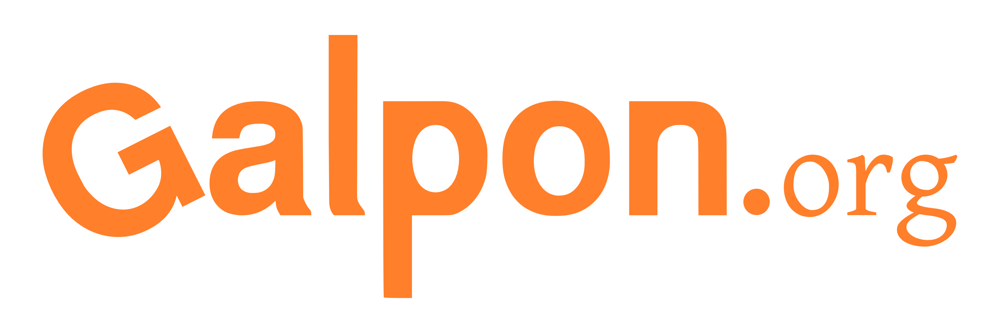

# Curso WebGIS. Mapas libres con Leaflet y OpenLayers

## Autores del Taller

Francisco Puga. [@fpuga](https://twitter.com/fpuga). Desarrollador GIS en iCarto 

Micho García. [@michogar](https://twitter.com/michogar). Desarrollador GIS en geomati.co 

## Licencia
 Esta obra está bajo una <a rel="license" href="http://creativecommons.org/licenses/by-sa/4.0/">Licencia Creative Commons Atribución-CompartirIgual 4.0 Internacional</a>.

## Organizado por

## Requerimientos
Para un correcto seguimiento del curso el alumno deberá tener conocimientos de:

* JavaScript ES6, HTML y algo de CSS
* `npm` para instalar y lanzar tareas
* Le tiene que sonar que es un `JSON`

Será necesario tener instalado en el equipo:

* [npm Linux](https://nodejs.org/en/download/package-manager/) o [npm Windows](https://nodejs.org/en/download/)
* [reload](https://www.npmjs.com/package/reload) o cualquier otro servidor web (Apache, nginx...) con el que el alumno se sienta cómodo

## Objetivo
El objetivo del curso es hacer una introducción al webgis a través del uso de las librerías de mapas Leaflet y OpenLayers. Estas son las librerías de referencia dentro del software libre para la creación de mapas en la web.

Mas allá de tratarse de un curso de programación de las librerías, se enfoca el curso desde un punto de vista más global que permita al alumno al final del mismo tener las herramientas necesarias, no solo para programar un sencillo visor, sino también para conocer de donde obtener datos, que diferentes sistemas de coordenadas hay, que tipos de datos existen dentro del mundo de los mapas y más respuestas a las tareas básicas de un desarrollador de aplicaciones web con mapas.

## Metodología del curso
El curso es eminentemente práctico por lo que se irán avanzando en los supuestos prácticos que los tutores vayan planteando. Se realizará por parejas por cada equipo.

## Temario
1. Creando un mapa. HTML, CSS y JS
2. El mapa sin datos. Añadir una capa base
    1. Servicios de capas globales, Bing, Google, Mapbox.
    2. Capas bases locales, PNOA.
3. Mas allá de la capa base, añadiendo mis propios datos
    1. ¿Qué es una capa vectorial?
    2. El formato GeoJSON
    3. Servicios WFS
4. Y si los datos son enormes
    1. WMS, WMS-T, XYZ
5. Interactuando con el mapa
    1. Consultando una capa al servidor
    2. Consultando una capa en el cliente
6. ¡¡Quiero tener mis datos!!
    1. [Usando OpenStreetMap como fuente de datos, Tilemill. Enlace a GeoTalleres](https://geotalleres.readthedocs.io/es/latest/josm-imposm-tilemill/index.html)

